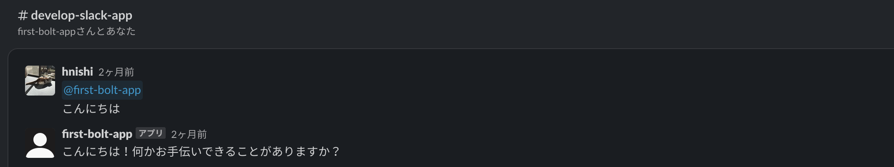
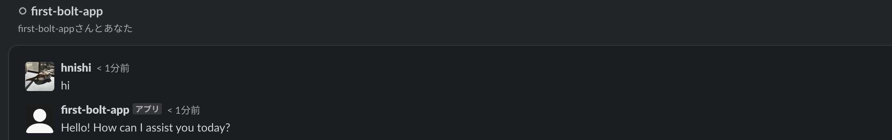

# gpt-slack-bot

Simple Slack bot using OpenAI Chat API.

You can talk to the chat bot using OpenAI Chat API via Slack.

## Usage in Slack

### Public and private channels in which the bot is added

You have to mention the bot to talk to it.



### Direct messages to the bot

You can talk to the bot without mentioning it.



## Slack App Configuration

1. Create an Slack app

    - See [the document](https://slack.dev/bolt-python/tutorial/getting-started).

1. Socket Mode

    - On

1. Bot Token Scopes

    - app_mentions:read
    - chat:write
    - im:history
    - im:read
    - im:write

1. App Token Scopes

    - connections:write

1. Event Subscriptions (Subscribe to bot events)

    - app_mentions:read
    - message.im

1. Messages Tab

    - App Home --> Show Tabs --> Messages Tab
    - Check `Allow users to send Slash commands and messages from the messages tab`

## Prerequisites

1. [Recommended] Create a Python virtual environment

    Using a Python virtual environment is recommended for isolating dependencies.

    ```shell
    python -m venv .venv
    source .venv/bin/activate
    ```

1. Install the required packages

    ```shell
    pip install -r requirements.txt
    ```

## App Configuration

1. Set the necessary environment variables

    ```shell
    export SLACK_BOT_TOKEN=xoxb-xxx
    export SLACK_APP_TOKEN=xapp-xxx
    export OPENAI_API_KEY=sk-xxx
    ```

## Running the application

1. Run the application

    ```shell
    python app.py
    ```

## References

- [Slack | Bolt for Python](https://slack.dev/bolt-python/concepts)
- [GitHub - openai/openai-python: The OpenAI Python library provides convenient access to the OpenAI API from applications written in the Python language.](https://github.com/openai/openai-python)
- [OpenAI API Documentation](https://platform.openai.com/docs/introduction)
